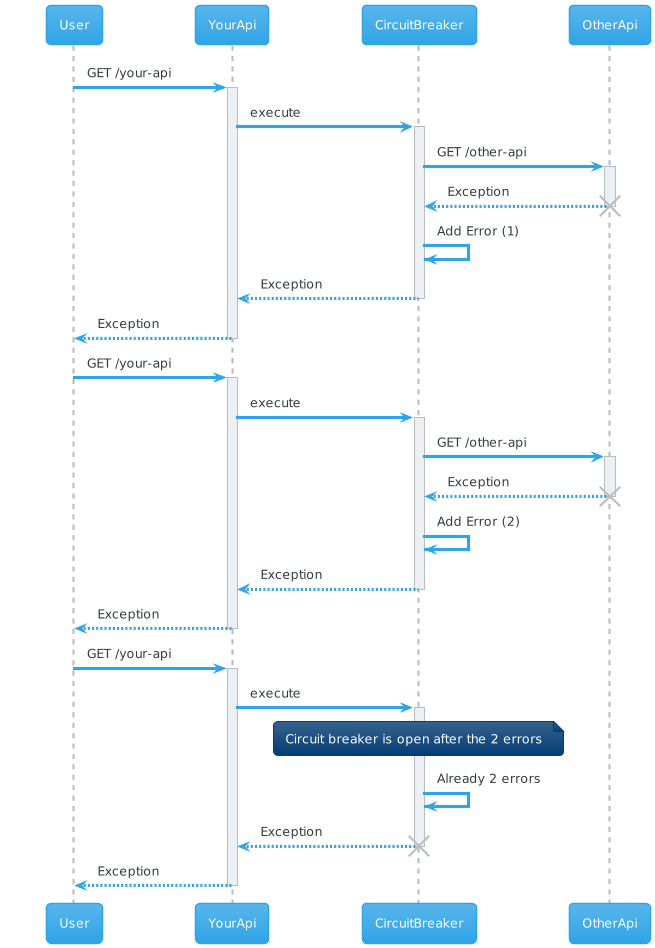
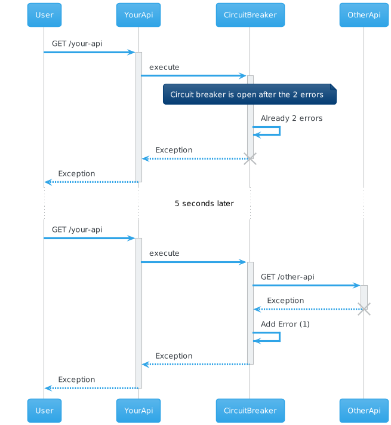
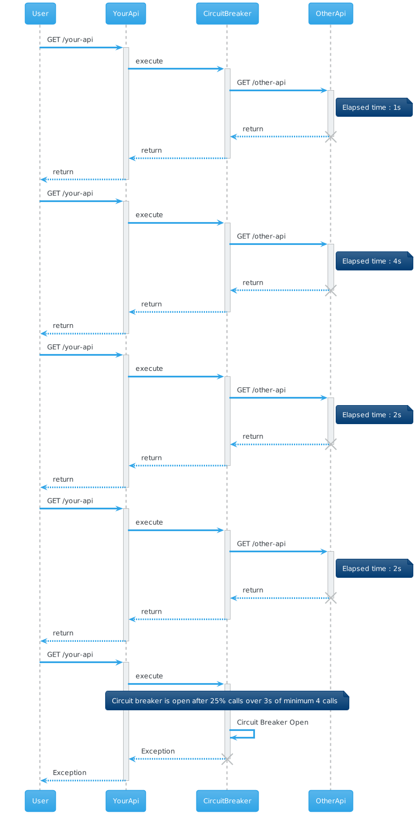

# Hystrix - Resilience4j - Microprofile Fault Tolerance

This repository contains a test around implementation of resilience and (for the moment) around Circuit breaker.

I use 3 libraries, and I want to see implementation, configuration, complexity and result.

To help me (and for my curiosity of course ^_^), I use **microprofile starter** to initialise all this project.

Table of Contents
=================

* [Context](#context)
* [Microprofile Starter](#microprofile-starter)
    * [About Wildfly Jar](#about-wildfly-jar)
* [Projects](#projects)
    * [You need](#you-need)
    * [Run it](#run-it)
    * [API](#api)
        * [Project path](#project-path)
        * [Endpoints](#endpoints)
* [Circuit Breaker configuration](#circuit-breaker-configuration)
    * [Request Volume Threshold](#request-volume-threshold)
    * [Error Threshold Percentage](#error-threshold-percentage)
    * [Sleep Window](#sleep-window)
    * [Bonus Resilience4j - Slow Call Rate Threshold and Slow Call Duration Threshold](#bonus-resilience4j---slow-call-rate-threshold-and-slow-call-duration-threshold)
* [Circuit breaker Results](#circuit-breaker-results)
    * [Hystrix](#hystrix)
    * [Resilience4j](#resilience4j)
    * [Microprofile fault tolerance](#microprofile-fault-tolerance)
* [Unit Tests](#unit-tests)
    * [Hystrix](#hystrix-1)
    * [Resilience4j](#resilience4j-1)
    * [Microprofile fault tolerance](#microprofile-fault-tolerance-1)

## Context

This is a test around this 3 libraries

- [Hystrix](https://github.com/Netflix/Hystrix) (_Deprecated : use Resilience4j Instead..._)
- [Resilience4j](https://resilience4j.readme.io/)
- [Microprofile Fault Tolerance](https://download.eclipse.org/microprofile/microprofile-fault-tolerance-2.1/microprofile-fault-tolerance-spec.html)

_For the moment, I only use the "Circuit Breaker"._

## Microprofile Starter

To initialise the project, I use [Microprofile starter](https://start.microprofile.io/) with this configuration

- MP 3.3
- JDK 11
- Wildfly

### About Wildfly Jar

Version **1.0.0.Alpha4** (include in MP Starter)

[more information about this maven plugin](https://docs.wildfly.org/21/Bootable_Guide.html)

## Projects

Each folder contains circuit breaker library :

- [Hystrix](hystrix)
- [Resilience4j](resilience4j)
- [MP Fault Tolerance](mp-faulttolerance)

### You need

- JDK 11
- Maven 3.6.X

### Run it

Start Maven command

```shell
mvn clean package wildfly-jar:run
```

### API

Every project run on http://localhost:8080

#### Project path 

- hystrix : http://localhost:8080/hystrix
- resilience4j : http://localhost:8080/r4j
- Microprofile Fault Tolerance : http://localhost:8080/mp-ft 

#### Endpoints

Every project expose 2 endpoints :

- _/github_ : this endpoint access to github (https://api.github.com/repos/jufab/opentelemetry-angular-interceptor/releases) and have Circuit Breaker configuration but depend on github availability's
- _/github/exception_ : this endpoint generates a BadRequestException to force circuit breaker reaction  
- (Only on Resilience4j, see [Bonus](#bonus-resilience4j---slow-call-rate-threshold-and-slow-call-duration-threshold)) _/github/slow_ : this endpoint reduce respone time (with a Thread.sleep() )    

## Circuit Breaker configuration

Every project have the same configuration : 

- Request Volume Threshold (or Minimum Number Of Calls) : 4
- Error Threshold Percentage (or failure Rate Threshold) : 50% 
- Sleep Window (or Wait Duration In Open State or Delay) (Duration) : 5 seconds

So, If there are 2 errors on 4 requests (50%), circuit breaker is open during 5 seconds.

_At first try, there are 4 requests before trigger the circuit breaker..._

### Request Volume Threshold

You have circuit breaker between your api exposed and an external API (or an other service/database/etc...)

Suppose that **Request Volume Threshold** have a value of 2, the sequence is : 

This a sequence diagram to help to understand the Request Volume Threshold (or minimum number of calls for Resilience4j)



Circuit breaker open after 2 errors : we suppose Error Threshold Percentage have a value of 100%

[plantuml](http://www.plantuml.com/plantuml/umla/xP4_JyCm4CLtVufZWo6rwDW1jQ2AaGK6HjS-i4LYM-Tp__3fSQGwL0aLI6o8yLtUpqzvRvbO4UUk5HVEwpOR1CiSqq9AKhlPgsERDpaXwU0PFSzqwEGcQRjJz2vZ0Hkss66IdKgC98zA8-KMbJ-nDFKswsz2F2KaQ6xWEMHQHGSBk5y_WZmKsQZeXDBijegn6aGr5kREaSwERmdL6r91SOywCmxGo256G7dYWIsUveQYHy7L8WPlyrNsUgyniWjU64nCuJ20qzWflJ86raI1uFBwQW9yzZCAElUZrTsJVSFdiADlEiF_3FC_FuCFvHQsIACFYwfXStpB9GWHFQWNBeejmXomhodzgDIMK9d3XFccrphWRqjTeZUvQpy0)

### Error Threshold Percentage

This configuration is the percentage of error before circuit breaker open.

So, 50% of 4 Request Volume Threshold, the circuit breaker open after 2 errors.

### Sleep Window

It's time during circuit breaker is Open and wait to Close (or Half Open).

This schema from Resilience4j resume this state : 


If you make call during this time, you have an exception by the circuit breaker. 

After this time, circuit breaker closed 

With previous sequence and a value of 5 seconds : 


 
[plantuml](http://www.plantuml.com/plantuml/umla/lP4_JyCm4CLtVufZWo69G6BfW5fGnSW20wDhFuX5OaVdS__mwN6bkchJ8bL2OdmlxvSxlvj6qIofxzILywPB5jIA377IDAnNzQUJDYrI19lW1Lvg4_fc4KsxqlpT31cif4MFsFGw2hZPAGDE7RG_Y5J5gxUUKcyHJDK3lOV4iy7HX9xdhzHiigpqu9GsufPQK0Ag13FpvDWa9uyC_GNEADOmIR27HWdbG_R24ZpwC2cQ5hj_kKXXW2Vz8Lb92xeZC0UEwXWzkyUiOsYx-PqvUl1yRJ282rvPHE6m6QzTebjiszU8EQb8rNLzJn4cU1kfqmBEpZztVLhJYxGud1ko7Wqk4RNFLkTcdpPMyXTTnrgQCmUcwzkRoqzJblphTQRmDlNT3m00)

### Bonus Resilience4j - Slow Call Rate Threshold and Slow Call Duration Threshold

After advice of Robert Winkler (@rbrtwnklr) on [Twitter](https://twitter.com/rbrtwnklr/status/1325387117825036288?ref_src=twsrc%5Etfw%7Ctwcamp%5Etweetembed%7Ctwterm%5E1325387117825036288%7Ctwgr%5Eshare_3&ref_url=https%3A%2F%2Fpublish.twitter.com%2F%3Fquery%3Dhttps3A2F2Ftwitter.com2Frbrtwnklr2Fstatus2F1325387117825036288widget%3DTweet), I try this two configurations.

- Slow Call Duration Threshold define time of a slow call (default 60000 ms)
- Slow Call Rate Threshold is a percent value (value between 0 to 100 _default 100_). it's calculate with the minimumNumberOfCalls value and the number of slow call

For example, we have this configuration : 

- minimumNumberOfCalls = 4
- slowCallRateThreshold = 25%
- slowCallDurationThreshold = 3 secondes

And there is no error during call (we have a response) but just a slow call...



[plantuml](http://www.plantuml.com/plantuml/umla/xP4_JyCm4CLtVufZO4mZIbaoe0Ag6Bl0mEWwryOYjgFpkN_uzBXgRPKGO0C9TQhU-Rrtrr-cdYLnCAsuq5QreKPec3jVbIN9pMYbkGcBu96KiuoMHygPSk5Liv7qLdOnM7231drff6UaygWKKcXHsXDBaMQZ_Ko8vzWAnIsyk41tdOOA7cTFKEwYB6IdXLIirv8n6KGonio39XKqtnFALwGOnIsgm9X3FOVe1MB5d1iytUkYxYrE5c5TLAHN3UTP1RDMTXvhO6qmbbnvaIkBeHC9EP0LDNecjyj5dqxxW2I7llfZ6KgCxOaEPLBVlsC--NNcP-RZlsP-PdvcVg3craYzXoffM1oxj0VNeGMvvAZ6DvUWPDlwG_Ww_Yx1QAjDC30vFFMe3TwNjgJ9FAxudlPigx1ZxV9N-fbspWm2dwAjWsdV0G00)

Circuit Breaker is now open because we have 25% (slowCallRateThreshold) of 4 calls (minimumNumberOfCalls) greater than 3 secondes (slowCallDurationThreshold)

_Sleep Window reset circuit breaker state (open to close)..._

## Circuit breaker Results

### Hystrix

In exception endpoint

- _Circuit breaker close_ : expose an HystrixException with a BadRequestException cause
- _Circuit breaker open_ : expose an HystrixException with a RuntimeException cause

### Resilience4j

In exception endpoint

- _Circuit breaker close_ : expose a BadRequestException
- _Circuit breaker open_ : expose a CallNotPermittedException

### Microprofile fault tolerance

In exception endpoint

- _Circuit breaker close_ : expose a BadRequestException
- _Circuit breaker open_ : expose a CircuitBreakerOpenException

## Unit Tests

Try to test with a unit test circuit breaker (for example in case of fallback?)

### Hystrix

Can forceOpen programmatically

see [here](hystrix/src/test/java/fr/jufab/hystrixr4jlab/infrastructure/github/)

### Resilience4j

Can forceOpen programmatically

see [here](resilience4j/src/test/java/fr/jufab/hystrixr4jlab/infrastructure/github/)

### Microprofile fault tolerance

No unit test for the circuit breaker : only on integration test (_Not Implemented_)


_to be continued..._


